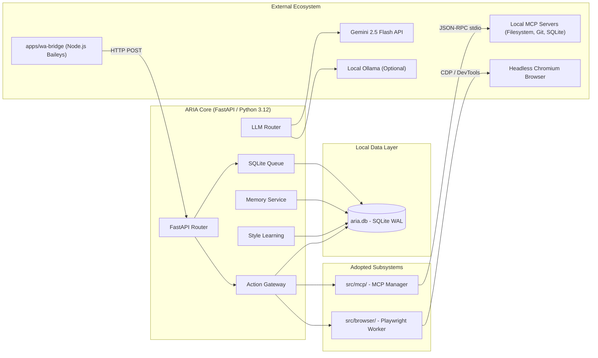

# ARIA Repository Capability Audit & Architectural Evolution Matrix

**Document Version:** 1.0.0  
**Date:** 2026-09-11  
**Status:** Canonical Subsystem Architecture & Repository Evaluation  
**Author / Lead:** AI Systems Architecture Team & Morice Rugemarila  

---

## 1. Executive Summary & Audit Mandate

This document establishes the definitive capability audit of ten leading open-source AI and agentic software repositories evaluated directly against the **existing ARIA architecture**.

The guiding principle of this audit is:
> **Maximum useful ARIA capability with minimum unnecessary complexity.**  
> Do not blindly install or integrate repositories. Every subsystem must have **one clear owner**.  
> Avoid duplicate agent frameworks, duplicate memory layers, duplicate browser engines, and duplicate orchestration systems.

ARIA is already an operational, resilient personal AI assistant possessing:
- **ARIA Core:** Multi-agent specialized routing (`src/agents/`: communication, learning, research, jobsearch, briefing, proactive).
- **Persistent Personal Memory:** SQLite + sqlite-vec / pgvector semantic search, memory chunking, time-decay, and memory governance (`src/memory/`).
- **Communication-Learning Personality:** Exemplar mining, style pattern extraction, dynamic few-shot drafting, Swahili/Sheng cultural competence, and explicit feedback learning (`src/communication/`).
- **WhatsApp Bridge:** Dual-process architecture isolating Baileys read-only observation from send execution, protected by 9-signal autonomy gates, standing contact policies, and human typing presence (`apps/wa-bridge/`, `src/whatsapp/`).
- **Action Gateway:** Two-phase commit execution with cryptographically logged audit events and pre-authorization policies (`src/gateway/`).
- **Local/Cloud Model Routing:** Fast local fallback (`Ollama`) and high-reasoning cloud routing (`Gemini 2.5 Flash`) with cost accounting (`src/llm/`).

---

## 2. In-Depth Evaluation of the 10 Repositories

Each repository is audited across 14 rigorous technical dimensions.

---

### 1. Model Context Protocol (MCP) Servers
- **Repository:** [`modelcontextprotocol/servers`](https://github.com/modelcontextprotocol/servers)
- **Primary Capability:** Standardized JSON-RPC 2.0 open protocol (created by Anthropic) enabling LLMs and agents to discover and invoke tools, data resources, and prompts over stdio or HTTP/SSE.
- **Does ARIA Already Provide This?** Partially. ARIA has internal tool execution hardcoded within `src/research/sources.py`, `src/agents/jobsearch.py`, and `src/gateway/`. ARIA does not have a dynamic, pluggable protocol to connect to third-party tools.
- **What ARIA Would Gain:** Instant, modular access to an ecosystem of standardized tools (filesystem, GitHub, PostgreSQL, SQLite, Brave search, Slack, Google Drive, Fetch) without writing bespoke Python wrappers for each service.
- **Integration Complexity:** Low. Requires a clean client manager (`src/mcp/client.py`, `src/mcp/manager.py`) that launches child process servers or connects via SSE and registers tool schemas into the Action Gateway.
- **Runtime Cost:** Negligible. Stdio JSON-RPC processes consume 10–30 MB RAM only when active.
- **Local / Offline Capability:** 100% Local / Offline. Local MCP servers run as child processes on Morice's machine.
- **Security Implications:** Highly favorable. Tools execute in isolated subprocesses; invocation is governed by ARIA's Action Gateway and audit logging.
- **Maintenance Risk:** Very Low. Protocol specification is open, stable, and backed by broad industry adoption.
- **License:** MIT.
- **Dependency Impact:** Minimal. Standard library `asyncio` subprocess or lightweight client library. Zero bloat.
- **Duplicate Functionality:** None. Complements and expands ARIA's Action Gateway.
- **Reliability Impact:** Increases reliability by standardizing tool interfaces and isolating crashes to subprocesses.
- **Capability Impact:** Dramatically increases capability across file operations, system tools, and third-party APIs.
- **Classification:** **`ADOPT NOW`**

---

### 2. Browser Use
- **Repository:** [`browser-use/browser-use`](https://github.com/browser-use/browser-use)
- **Primary Capability:** Autonomous web browsing agent using Playwright and vision/DOM extraction to interact with real websites (click, fill forms, scroll, extract data, navigate).
- **Does ARIA Already Provide This?** No. ARIA currently only has text-based web search via the Tavily API in `src/research/sources.py`. ARIA cannot interact with web applications, log into dashboards, or fill job applications on web portals.
- **What ARIA Would Gain:** Full interactive web automation: filling online application forms, verifying online bookings, web scraping JavaScript-heavy sites, and visual DOM interaction.
- **Integration Complexity:** Medium. Integrated as an isolated worker controlled exclusively by ARIA's Action Gateway and specialized agents.
- **Runtime Cost:** Moderate to High. Playwright Chromium headless instance requires ~150–300 MB RAM; vision LLM calls consume token quota.
- **Local / Offline Capability:** Runs locally (Playwright browser), but requires vision/DOM reasoning via local VLM or cloud LLM.
- **Security Implications:** High. Must be strictly gated: destructive web actions (submitting forms, payments, logins) must require explicit Action Gateway approval policies.
- **Maintenance Risk:** Moderate. Fast-moving open-source repository; browser automation requires handling site changes.
- **License:** MIT.
- **Dependency Impact:** Moderate (`playwright`, browser binaries).
- **Duplicate Functionality:** None. ARIA currently lacks browser interaction.
- **Reliability Impact:** High for web tasks, provided execution has timeouts and fallbacks.
- **Capability Impact:** High. Solves real-world interactive web workflows.
- **Classification:** **`USE ONLY FOR SPECIFIC SUBSYSTEM`** (Dedicated Web Automation Worker under Action Gateway)

---

### 3. OpenClaw
- **Repository:** [`openclaw/openclaw`](https://github.com/openclaw/openclaw)
- **Primary Capability:** Multi-channel personal AI assistant gateway (WhatsApp, Discord, Telegram, Slack) with modular hooks.
- **Does ARIA Already Provide This?** Yes, for WhatsApp. ARIA already includes `apps/wa-bridge` (Baileys dual-process observer/sender) and `openclaw-hook/`.
- **What ARIA Would Gain:** Broader multi-channel messaging support (e.g. Discord, Telegram) if Morice expands beyond WhatsApp.
- **Integration Complexity:** Low. ARIA's `/whatsapp/ingest` endpoint was specifically architected to accept OpenClaw webhook payloads with `OPENCLAW_INGEST_SECRET`.
- **Runtime Cost:** Low to Moderate (Node.js runtime).
- **Local / Offline Capability:** 100% Local / Self-hosted.
- **Security Implications:** Moderate. External webhook gateway requires shared secret validation (already enforced in ARIA).
- **Maintenance Risk:** Moderate.
- **License:** MIT.
- **Dependency Impact:** Zero to core Python backend; lives as an external sidecar service.
- **Duplicate Functionality:** Duplicates ARIA's existing WhatsApp bridge if used for WhatsApp. Useful if expanding to other channels.
- **Reliability Impact:** Neutral for WhatsApp; expands reach for other chat platforms.
- **Capability Impact:** Moderate (multi-platform messaging).
- **Classification:** **`USE ONLY FOR SPECIFIC SUBSYSTEM`** (External Sidecar Gateway for Non-WhatsApp Channels)

---

### 4. Mem0
- **Repository:** [`mem0ai/mem0`](https://github.com/mem0ai/mem0)
- **Primary Capability:** Multi-tier personalized long-term memory for AI agents (user, session, and assistant memory graphs/vectors).
- **Does ARIA Already Provide This?** Yes. ARIA already has a mature, highly tailored personal memory engine (`src/memory/service.py`, `src/memory/governance.py`) featuring `MemoryItem`, `MemoryChunk`, cosine similarity over vector embeddings, time decay, importance scoring, and scoping per contact (`contact:id`, `relationship:type`).
- **What ARIA Would Gain:** Graph-based user profile memory extraction out of the box.
- **Integration Complexity:** High. Would require tearing out or wrapping ARIA's SQLite memory tables and re-architecting existing queries.
- **Runtime Cost:** High. Extra LLM extraction calls for every ingested message; default cloud-oriented storage.
- **Local / Offline Capability:** Partial (requires local Qdrant/Chroma and embedding models, but often leans on cloud).
- **Security Implications:** Negative if using cloud Mem0; personal data leaked to third-party endpoints.
- **Maintenance Risk:** High. Rapidly changing API; cloud platform push.
- **License:** Apache 2.0.
- **Dependency Impact:** Heavy (`qdrant-client`, `chromadb`, etc.).
- **Duplicate Functionality:** **100% DUPLICATE.** Directly duplicates ARIA Core Memory.
- **Reliability Impact:** Negative. Introduces another state store and vector database alongside ARIA's SQLite/PostgreSQL.
- **Capability Impact:** Negligible. ARIA already retrieves relevant memories and facts with lower latency.
- **Classification:** **`REJECT`** (Violates Subsystem Single-Ownership Principle)

---

### 5. Graphiti
- **Repository:** [`getzep/graphiti`](https://github.com/getzep/graphiti)
- **Primary Capability:** Dynamic temporal knowledge graph memory engine that maps entities, relationships, and how facts change over time.
- **Does ARIA Already Provide This?** Partially. ARIA extracts entity facts and style patterns into SQLite (`document_facts`, `style_patterns`), but does not maintain an explicit temporal graph topology with bi-temporal edges.
- **What ARIA Would Gain:** Rich temporal relationship tracking (e.g. "Morice worked at X from date A to B, then transitioned to Y").
- **Integration Complexity:** High. Requires a graph database backend (Neo4j, FalkorDB, or embedded Kùzu) and dedicated extraction pipelines.
- **Runtime Cost:** High. Generating entity-relationship graphs requires multiple LLM reasoning passes per conversation.
- **Local / Offline Capability:** Moderate. Requires hosting a local graph database engine.
- **Security Implications:** Low if self-hosted; personal knowledge remains on-device.
- **Maintenance Risk:** Moderate.
- **License:** Apache 2.0.
- **Dependency Impact:** Heavy (graph database drivers, asynchronous graph libraries).
- **Duplicate Functionality:** Partially overlaps with ARIA's facts and memory items.
- **Reliability Impact:** Potential point of failure due to database synchronization between SQLite and Graph DB.
- **Capability Impact:** High for deep personal biographical history; low for day-to-day assistant tasks.
- **Classification:** **`EVALUATE`** (Re-evaluate in Phase 3 when entity relationship volume justifies dedicated graph infrastructure)

---

### 6. LlamaIndex
- **Repository:** [`run-llama/llama_index`](https://github.com/run-llama/llama_index)
- **Primary Capability:** Enterprise RAG framework, data connectors, and document indexing pipelines.
- **Does ARIA Already Provide This?** Yes. ARIA has a purpose-built, lightweight document ingestion and hybrid retrieval system (`src/documents/`, `src/memory/service.py`, `src/research/sources.py`) that handles PDF/text extraction, chunking, and keyword/semantic search in <250 lines of clean code.
- **What ARIA Would Gain:** Hundreds of out-of-the-box data loaders (Notion, Google Docs, Confluence, etc.).
- **Integration Complexity:** High. LlamaIndex has an opinionated, monolithic execution model that conflicts with ARIA's direct SQLAlchemy / AsyncSession database layer.
- **Runtime Cost:** Moderate to High.
- **Local / Offline Capability:** Good.
- **Security Implications:** Neutral.
- **Maintenance Risk:** Very High. Extremely frequent breaking changes across versions, deprecated classes, and bloated dependency tree (>1.2 GB disk footprint).
- **License:** MIT.
- **Dependency Impact:** Massive bloat (hundreds of transitive packages).
- **Duplicate Functionality:** **100% DUPLICATE.** Duplicates ARIA's memory, document, and RAG pipelines.
- **Reliability Impact:** Negative. Fragile dependency tree and high risk of version conflicts.
- **Capability Impact:** Negligible for ARIA's personal document scale.
- **Classification:** **`REJECT`** (Unacceptable Dependency Bloat; Duplicates Working Components)

---

### 7. Temporal
- **Repository:** [`temporalio/temporal`](https://github.com/temporalio/temporal)
- **Primary Capability:** Enterprise distributed durable execution engine for stateful workflows, retries, and compensation.
- **Does ARIA Already Provide This?** Yes, scaled appropriately. ARIA has a durable transactional SQLite queue (`inbound_messages`, `outbound_messages`, `action_requests`) with exponential backoff, dead-letter storage, and idempotent processing (`src/whatsapp/queue.py`, `src/proactive/scheduler.py`).
- **What ARIA Would Gain:** Enterprise workflow replay across cluster nodes.
- **Integration Complexity:** Extremely High. Requires running external Go server daemons, Cassandra or PostgreSQL clusters, and rewriting asynchronous Python tasks into Temporal workflow definitions.
- **Runtime Cost:** Massive. Consumes >1.5 GB RAM just for orchestrator infrastructure.
- **Local / Offline Capability:** Self-hostable, but heavy.
- **Security Implications:** Adds network services and open ports.
- **Maintenance Risk:** High. Enterprise infrastructure management overhead for a personal assistant.
- **License:** MIT.
- **Dependency Impact:** Heavy (`temporalio` SDK + external server cluster).
- **Duplicate Functionality:** **100% DUPLICATE.** Replaces ARIA's elegant SQLite queue.
- **Reliability Impact:** Overkill. High operational burden increases likelihood of downtime on a single personal PC.
- **Capability Impact:** Zero tangible benefit for single-user personal workloads.
- **Classification:** **`REJECT`** (Severe Architectural Over-Engineering)

---

### 8. LiveKit Agents
- **Repository:** [`livekit/agents`](https://github.com/livekit/agents)
- **Primary Capability:** Real-time multimodal voice AI framework over WebRTC, providing ultra-low-latency speech-to-speech, VAD (Voice Activity Detection), and audio streaming.
- **Does ARIA Already Provide This?** Partially. ARIA currently handles asynchronous voice notes (speech-to-text transcription via Whisper/Gemini in `src/llm/gemini.py` and `apps/wa-bridge`). ARIA does not yet support real-time full-duplex conversational voice calls.
- **What ARIA Would Gain:** Real-time conversational phone calls and voice interaction directly through the browser, mobile app, or SIP bridge.
- **Integration Complexity:** Moderate to High. Requires WebRTC server setup (LiveKit server) and audio streaming workers.
- **Runtime Cost:** Moderate. Real-time audio processing requires continuous streaming audio inference.
- **Local / Offline Capability:** High with local STT (Whisper) and TTS (Kokoro/Piper); cloud-capable with Deepgram/Cartesia.
- **Security Implications:** Audio streaming channels must be authenticated and encrypted.
- **Maintenance Risk:** Low to Moderate. LiveKit is the recognized open standard for WebRTC voice agents.
- **License:** Apache 2.0.
- **Dependency Impact:** Moderate (`livekit-agents`).
- **Duplicate Functionality:** None. Extends ARIA into synchronous real-time voice.
- **Reliability Impact:** High for voice communication.
- **Capability Impact:** High. Realizes the long-term vision of conversational voice interaction.
- **Classification:** **`INTEGRATE LATER`** (Dedicated Realtime Voice Subsystem for Phase 2)

---

### 9. CrewAI
- **Repository:** [`crewAIInc/crewAI`](https://github.com/crewAIInc/crewAI)
- **Primary Capability:** Role-playing multi-agent orchestration framework (Crews, Agents, Tasks, Hierarchical processes).
- **Does ARIA Already Provide This?** Yes. ARIA's specialized agents (`src/agents/`: communication, learning, research, jobsearch, briefing, proactive) already perform role-specific reasoning with centralized task classification (`src/llm/router.py`) and safety governance (`src/gateway/`).
- **What ARIA Would Gain:** Generic persona prompts and pre-configured multi-agent loops.
- **Integration Complexity:** High. Forces opinionated LangChain-style prompt chains and agent loops that fight against ARIA's deterministic execution and Action Gateway.
- **Runtime Cost:** Extremely High. Multi-agent debate loops trigger cascading LLM calls, quickly burning token quotas and causing high latency.
- **Local / Offline Capability:** Moderate, but struggles on small local models due to complex JSON formatting demands.
- **Security Implications:** Negative. Hard to enforce strict deterministic safety gates over autonomous multi-agent chatter.
- **Maintenance Risk:** High. Frequent breaking changes; wrapper churn.
- **License:** MIT.
- **Dependency Impact:** Heavy (`crewai`, `langchain`, etc.).
- **Duplicate Functionality:** **100% DUPLICATE.** Directly duplicates ARIA's agent architecture.
- **Reliability Impact:** Negative. Unbounded multi-agent loops are prone to hallucinations, infinite loops, and token exhaustion.
- **Capability Impact:** Negative to Neutral.
- **Classification:** **`REJECT`** (Violates Single-Owner Rule; Duplicates Agent Architecture)

---

### 10. Microsoft Agent Framework
- **Repository:** [`microsoft/agent-framework`](https://github.com/microsoft/agent-framework)
- **Primary Capability:** Enterprise multi-agent conversational framework unifying AutoGen and Semantic Kernel patterns.
- **Does ARIA Already Provide This?** Yes. ARIA Core already provides conversation management, model routing, and agent coordination.
- **What ARIA Would Gain:** Enterprise Azure-centric patterns.
- **Integration Complexity:** High. Heavy enterprise abstraction layers designed for Azure cloud infrastructure.
- **Runtime Cost:** Moderate to High.
- **Local / Offline Capability:** Poor to Moderate.
- **Security Implications:** Complex enterprise IAM dependencies.
- **Maintenance Risk:** High. Early-stage preview repository subject to significant architectural revisions.
- **License:** MIT.
- **Dependency Impact:** Heavy enterprise SDK footprints.
- **Duplicate Functionality:** **100% DUPLICATE.** Competes directly with ARIA Core.
- **Reliability Impact:** Negative. Unnecessary architectural complexity.
- **Capability Impact:** Negligible for Morice's personal assistant workload.
- **Classification:** **`REJECT`** (Enterprise Overlap; Duplicates ARIA Core)

---

## 3. Comprehensive Repository Capability Matrix

| Repository | Core Capability | Status in ARIA Today | Architectural Value to ARIA | Complexity | Runtime Cost | Local Capable | Security Posture | License | Recommendation |
| :--- | :--- | :--- | :--- | :--- | :--- | :--- | :--- | :--- | :--- |
| **Model Context Protocol (MCP)** | Standardized Tool Ecosystem (stdio/SSE) | Hardcoded tools in Python | **Transformative:** Plugs into hundreds of tools universally | Low | Minimal (<30MB) | 100% Local | Strong (Subprocess isolation + Gateway) | MIT | **`ADOPT NOW`** |
| **Browser Use** | Interactive Browser Automation (Playwright) | None (read-only Tavily search only) | **High:** Enables web actions, portal logins, job submissions | Medium | Moderate (150-300MB) | Yes (Local Playwright) | Needs Gateway Approval Policies | MIT | **`USE ONLY FOR SPECIFIC SUBSYSTEM`** |
| **OpenClaw** | Multi-channel Ingest Gateway | Implemented for WhatsApp via Baileys | **Moderate:** Gateway for Telegram, Discord if needed | Low | Low | 100% Local | Shared Secret Verification | MIT | **`USE ONLY FOR SPECIFIC SUBSYSTEM`** |
| **LiveKit Agents** | WebRTC Realtime Voice Streaming | Asynchronous voice note transcription only | **High:** Future conversational phone calls & voice chat | Medium-High | Moderate | Yes (Whisper/Piper local or Cloud) | Encrypted WebRTC | Apache 2.0 | **`INTEGRATE LATER`** |
| **Graphiti** | Dynamic Temporal Knowledge Graph | Entity facts in SQLite tables | **Moderate:** Complex temporal relationship tracking | High | High (Graph DB + LLM extract) | Requires local Graph DB | Local data safe | Apache 2.0 | **`EVALUATE`** |
| **Mem0** | Personalized Memory System | Fully implemented in `src/memory/` | **Zero / Duplicate** | High | High | Partial | Leans on cloud | Apache 2.0 | **`REJECT`** |
| **LlamaIndex** | Monolithic RAG & Ingestion Framework | Clean custom RAG in `src/documents/` | **Zero / Duplicate (>1GB bloat)** | High | Moderate | Yes | Neutral | MIT | **`REJECT`** |
| **Temporal** | Distributed Workflow Engine | Durable SQLite transactional queue | **Zero / Excessive Overhead** | Very High | Massive (>1.5GB) | Yes, but heavy | Complex ports/services | MIT | **`REJECT`** |
| **CrewAI** | Multi-Agent Role Playing Framework | Deterministic multi-agents in `src/agents/` | **Negative (Brittle prompt loops)** | High | Very High (Token bloat) | Poor on small models | Hard to gate safety | MIT | **`REJECT`** |
| **Microsoft Agent Framework** | Enterprise Agent Framework | Fully covered by ARIA Core | **Zero / Enterprise Overlap** | High | Moderate | Poor | Enterprise IAM bloat | MIT | **`REJECT`** |

---

## 4. Subsystem Ownership & Anti-Duplication Charter

To preserve software integrity, every subsystem has exactly **one canonical owner**.

```mermaid
graph TD
    subgraph "External Channels"
        WA[WhatsApp Web / Baileys] -->|HTTP / Shared Secret| INGEST[POST /whatsapp/ingest]
        EXT[Discord / Telegram via OpenClaw] -.->|HTTP / Shared Secret| INGEST
    end

    subgraph "ARIA Ingestion & Storage Layer (Owner: src/whatsapp/queue.py & SQLite)"
        INGEST --> DB_QUEUE[(SQLite Queue: inbound_messages)]
        DB_QUEUE --> WORKER[Background Queue Worker]
    end

    subgraph "Safety & Governance Layer (Owner: src/whatsapp/decision.py & src/gateway/)"
        WORKER --> GATEWAY{Action Gateway & Autonomy Gate}
        GATEWAY -->|Block / Ask User| REVIEW[Human Approval Queue]
        GATEWAY -->|Pre-Approved / Approved| EXEC[Gateway Executor]
    end

    subgraph "ARIA Intelligence & Personality (Owner: src/agents/ & src/communication/)"
        WORKER --> ROUTER[Model Router: Local Ollama / Gemini Cloud]
        ROUTER --> COMM[Communication Agent]
        ROUTER --> LEARN[Style Learning & Exemplars]
        ROUTER --> RESEARCH[Research Agent]
    end

    subgraph "Memory Subsystem (Owner: src/memory/)"
        COMM <--> MEM[(Personal Memory: SQLite / sqlite-vec)]
        RESEARCH <--> MEM
        LEARN <--> MEM
    end

    subgraph "Execution & Tool Ecosystem (ADOPTED SUBSYSTEMS)"
        EXEC --> MCP_CLI[MCP Tool Manager (NEW: src/mcp/)]
        EXEC --> BROWSER[Browser Automation Worker (NEW: src/browser/)]
        EXEC --> OUT_QUEUE[(Outbound Message Queue)]
        MCP_CLI --> TOOLS[Local MCP Servers: Filesystem, Git, SQLite, Fetch]
        BROWSER --> PLAYWRIGHT[Playwright Headless Browser]
        OUT_QUEUE --> SENDER[apps/wa-bridge/sender.js]
    end
```

### Subsystem Owner Registry

| Subsystem | Canonical Owner | Technologies | Anti-Duplication Rule |
| :--- | :--- | :--- | :--- |
| **Agent Orchestration** | ARIA Core (`src/agents/`) | Python, FastAPI, TaskClass router | **NO CrewAI, NO AutoGen, NO Microsoft Framework**. All agents report to ARIA Core. |
| **Personal Memory** | ARIA Memory (`src/memory/`) | SQLite + sqlite-vec / pgvector, cosine math | **NO Mem0**. ARIA owns the vector index, governance, decay, and style scopes. |
| **Voice & Personality** | ARIA Voice Learning (`src/communication/`) | Exemplar mining, style patterns, rule scoring | ARIA's Swahili/English voice patterns remain authoritative. |
| **Messaging Gateway** | Dual-Process Bridge (`apps/wa-bridge/`) | Baileys, Node.js, read-only observer + sender | Only `sender.js` holds WhatsApp send socket; optional OpenClaw sidecar for extra chat apps. |
| **Tool Ecosystem** | ARIA MCP Client (`src/mcp/`) | Model Context Protocol (stdio/SSE) | Standardize all external tools on MCP. No custom API spaghetti. |
| **Browser Automation** | ARIA Browser Worker (`src/browser/`) | Playwright, Browser Use principles | Isolated tool worker. Browser actions require Action Gateway authorization. |
| **Workflow Engine** | ARIA Queue (`src/whatsapp/queue.py`) | SQLite ACID transactions, exponential retry | **NO Temporal**. SQLite transactions guarantee zero message loss with zero extra servers. |
| **Document Intelligence**| ARIA Documents (`src/documents/`) | PyPDF, text chunking, hybrid search | **NO LlamaIndex**. Lean document processor natively integrated with memory service. |
| **Realtime Voice** | LiveKit Subsystem (`src/voice/` - Phase 2) | LiveKit Agents, WebRTC, Whisper, Piper | Standalone WebRTC voice streaming worker; activated only when real-time calling is launched. |
| **Security & Auditing** | ARIA Action Gateway (`src/gateway/`) | Immutable `audit_events`, signed JWT auth | Every tool execution and message send must pass through the Gateway. |

---

## 5. Recommended Final ARIA Architecture

The resulting target architecture combines ARIA's battle-tested foundation with two high-value, strictly scoped additions:

1. **Native MCP Tool Client Subsystem (`src/mcp/`)**:
   - Implements JSON-RPC 2.0 over standard I/O and HTTP Server-Sent Events (SSE).
   - Allows ARIA to declare and invoke tools provided by official and community MCP servers (`@modelcontextprotocol/server-filesystem`, `@modelcontextprotocol/server-sqlite`, `mcp-server-git`, etc.).
   - All tool executions are validated by ARIA's Action Gateway and recorded in the audit trail.

2. **Controlled Browser Automation Worker (`src/browser/`)**:
   - Provides headless Playwright automation guided by DOM extraction principles from `browser-use`.
   - Dedicated specifically to interactive web research, portal login checks, and job application assistance.
   - Guarded by Action Gateway policies: read-only navigation runs automatically; form submission/financial actions require explicit human confirmation.

3. **Phase 2 Realtime Voice Bridge (`src/voice/`)**:
   - Interfaces with LiveKit Agents when Morice is ready for full-duplex conversational voice calls.

---

## 6. Repository Adoption & Phased Implementation Plan

### Phase 1: Immediate Capability Expansion (`ADOPT NOW`)
- **Action:** Implement lightweight, zero-dependency MCP Client Manager in `apps/api/src/mcp/`.
- **Deliverables:**
  - `src/mcp/client.py`: Async JSON-RPC stdio/SSE client.
  - `src/mcp/manager.py`: Server discovery, tool registration, and Action Gateway binding.
  - `src/routers/mcp.py`: REST endpoints for dashboard inspection (`GET /mcp/servers`, `GET /mcp/tools`).
  - Unit and integration tests (`tests/test_mcp.py`).

### Phase 2: Interactive Browser Subsystem (`USE ONLY FOR SPECIFIC SUBSYSTEM`)
- **Action:** Build dedicated Browser Automation provider in `apps/api/src/browser/`.
- **Deliverables:**
  - `src/browser/service.py`: Playwright browser automation worker (navigate, screenshot, DOM extract, fill forms).
  - Safety policy in Action Gateway (`browser.navigate` = auto, `browser.submit` = supervised).
  - Integration with Job Search Agent (`src/agents/jobsearch.py`).
  - Browser tests (`tests/test_browser.py`).

### Phase 3: Realtime Voice Streaming (`INTEGRATE LATER`)
- **Action:** Integrate LiveKit Agents for bidirectional WebRTC voice calling.
- **Prerequisites:** Local or hosted LiveKit server, microphone/speaker pipeline.
- **Deliverables:** WebRTC voice bridge connecting speech-to-speech models with ARIA Core memory.

### Phase 4: Knowledge Graph Evaluation (`EVALUATE`)
- **Action:** Benchmark Graphiti against SQLite entity facts using historical message logs.
- **Criteria:** Adopt only if entity relation reasoning improves measurably without exceeding acceptable latency thresholds.

---

## 7. System Dependency Graph



---

## 8. Deployment Topology: What Runs Where

| Component | Target Runtime | Location | Port / Protocol | Reason |
| :--- | :--- | :--- | :--- | :--- |
| **ARIA API & Core** | Python 3.12 Uvicorn | Local PC / Server | `127.0.0.1:8000` | Coordinates all logic, memory, and safety. |
| **SQLite Database** | SQLite WAL | Local PC Disk | `aria.db` | Zero-latency, zero-overhead ACID persistence. |
| **Next.js Web Dashboard**| Node.js / Next.js 15 | Local PC / Server | `127.0.0.1:3000` | Human control interface and message review. |
| **WhatsApp Observer** | Node.js (Baileys) | Local PC / Server | HTTP to `:8000` | Read-only observation with disk spooling. |
| **WhatsApp Sender** | Node.js (Baileys) | Local PC / Server | Polling `:8000` | Send socket execution only after Gateway approval. |
| **MCP Tool Servers** | Node/Python Subprocesses| Local PC | Stdio Pipes | Isolated local tool execution (files, git, DB). |
| **Browser Automation** | Headless Chromium | Local PC | Playwright CDP | Direct web interaction without cloud browser costs. |
| **Phone Access** | Mobile Web / PWA | User's Phone | Tailscale / LAN | Encrypted mobile control via JWT authentication. |
| **Gemini 2.5 Flash** | Cloud Model API | Google Cloud | HTTPS / TLS 1.3 | High-reasoning classification, drafting, vision. |
| **Local LLM (Ollama)** | Local GPU/CPU | Local PC | `127.0.0.1:11434`| Offline fallback for routine classification. |
| **LiveKit Server (Phase 2)**| Go Docker Container| Home Server / VPS | `7880` (WebRTC) | Realtime audio streaming (disabled until Phase 2). |
| **Temporal / Mem0 / CrewAI**| **DISABLED / REJECTED**| None | None | Excluded to prevent architectural bloat. |

---

## 9. Estimated Hardware Resource Requirements

### Baseline Operational Profile (Current ARIA + MCP + Browser Automation)
- **RAM:**
  - ARIA FastAPI Backend: ~120 MB
  - Next.js Dashboard: ~90 MB
  - WhatsApp Bridge (Observer + Sender): ~140 MB
  - MCP Subprocess Servers: ~30–60 MB
  - Headless Browser (when active): ~250–350 MB
  - **Total Peak RAM:** **~650–750 MB** (Easily runs on any standard laptop or home server).
- **CPU:** <2% idle; bursts to 15–25% during active browser rendering or queue processing.
- **Disk Footprint:**
  - ARIA codebase + virtual environment: ~350 MB
  - Playwright Chromium binary: ~280 MB
  - SQLite Database (`aria.db` with 50,000 messages & embeddings): ~85 MB
  - **Total Disk Usage:** **<800 MB** (vs >4 GB if LlamaIndex + Temporal + Mem0 were added).
- **Network:** Only egress to Google GenAI API, Tavily, and WhatsApp WebSocket traffic.

---

## 10. Risk Assessment & Mitigation

| Risk | Impact | Probability | Mitigation Strategy |
| :--- | :--- | :--- | :--- |
| **Browser Form Submission Error** | High | Low | Browser actions requiring form submission or state changes are classified as `supervised` in Action Gateway; require Morice's confirmation. |
| **MCP Subprocess Hang / Crash** | Low | Low | Stdio pipes enforce 15-second execution timeouts; crashed child processes are restarted without affecting ARIA core. |
| **Gemini API Rate Limiting (429)** | Medium | Low | ARIA's queue worker implements exponential backoff and transparent fallback to local Ollama (`src/llm/router.py`). |
| **WhatsApp Disconnection** | Medium | Low | Durable local disk spool (`spool/pending/`) preserves all messages; automatic reconnect on socket drop. |
| **Dependency Conflicts** | High | Low | Sticking to zero-dependency MCP protocol and rejecting heavy frameworks (LlamaIndex, CrewAI) keeps dependencies pristine. |

---

## 11. Conclusion & Immediate Execution Directive

The evaluation is unequivocal:
1. **Do not install duplicate agent or memory frameworks.** ARIA's custom SQLite memory and deterministic multi-agent routing are already superior in reliability, speed, and privacy.
2. **Adopt the Model Context Protocol (MCP)** immediately as ARIA's universal tool layer.
3. **Incorporate Browser Automation** as a strictly governed, isolated subsystem.
4. **Reject Mem0, LlamaIndex, Temporal, CrewAI, and Microsoft Agent Framework** to safeguard ARIA from fragility, dependency hell, and unnecessary complexity.
